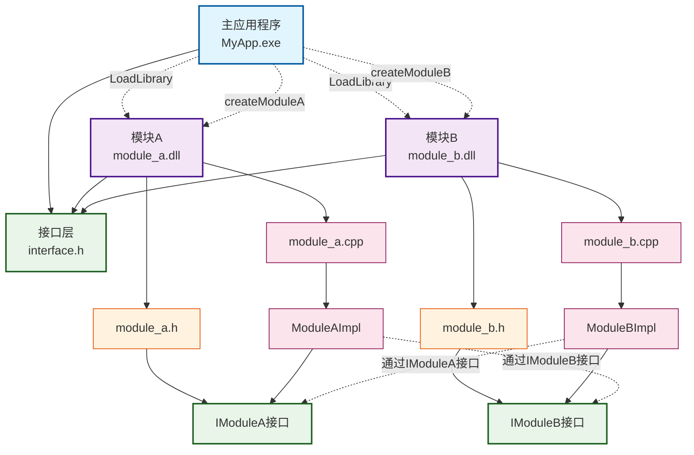
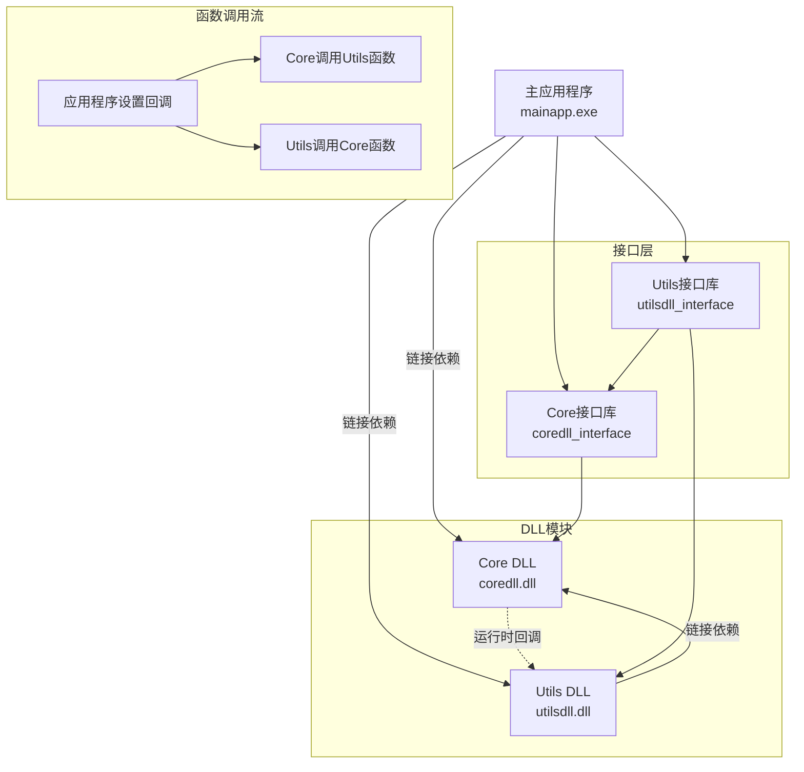
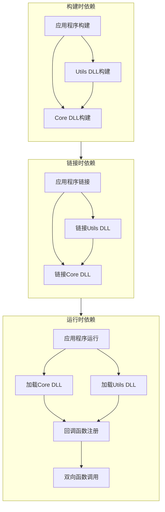

# Build
```
mkdir build  
cd build
cmake -G "MinGW Makefiles" ..
cmake -E time make -j
```

# PrototypePersonPet
```
project/
│
├─ interface/                  # 公共接口库
│   ├─ CMakeLists.txt          # INTERFACE 库
│   ├─ IPerson.h               # Person 接口
│   └─ IPet.h                  # Pet 接口
│
├─ person/                     # Person DLL
│   ├─ CMakeLists.txt
│   ├─ include/                # 头文件
│   │   └─ Person.h
│   └─ src/                    # 源文件
│       └─ Person.cpp
│
├─ pet/                        # Pet DLL
│   ├─ CMakeLists.txt
│   ├─ include/                # 头文件
│   │   └─ Pet.h
│   └─ src/                    # 源文件
│       └─ Pet.cpp
│
├─ app/                        # 客户端可执行程序
│   ├─ CMakeLists.txt
│   └─ main.cpp
│
└─ CMakeLists.txt              # 顶层 CMake 文件
```
关键词：动态加载dll/so隔离, pimpl隐藏细节, interface避免交叉依赖  
dll/so：因为动态链接库涉及系统层面，需要windows.h或dlfcn.h的支持  
interface: 单独的interface lib  
pimpl: 头文件里用pimpl隐藏细节。本例因为用inteface隔离，所以对全局编译优化没影响。但如果dll内部有很多文件共享一个头文件，就有意义(换句话说，如果dll内部很小，pimpl就没啥意义)。这样修改之后，头文件变小，只含有公开方法和Impl指针；而cpp文件会变大。  

注意：__declspec(dllexport) 确实是 Windows 上 导出 DLL 符号 的常见方法，但在这个例子里没有看到它。  
在 MSVC 下，如果没写 __declspec(dllexport)，CreatePerson 默认不会被导出。  
但在 MinGW/GCC 下，默认会把全局函数符号导出到 DLL。  
所以你即使没写 __declspec(dllexport)，也能在 GetProcAddress 里拿到 CreatePerson。  


# Interface DLL
```
MyApp/
├── CMakeLists.txt
├── app/
│   ├── CMakeLists.txt
│   └── main.cpp
├── interface/
│   ├── CMakeLists.txt
│   ├── imodule_a.h
│   ├── imodule_b.h
│   └── factory.h
├── module_a/
│   ├── CMakeLists.txt
│   ├── module_a.h
│   ├── module_a_impl.h
│   └── module_a.cpp
└── module_b/
    ├── CMakeLists.txt
    ├── module_b.h
    ├── module_b_impl.h
    └── module_b.cpp
```

## 关系图


## 关键关系说明
编译时依赖（实线箭头）  
- 主应用程序 → 接口层：包含接口头文件  
- 模块A/B → 接口层：实现接口定义  
- 模块内部：头文件和实现文件的包含关系  

运行时依赖（虚线箭头）  
- 主应用程序 → 模块A/B：通过LoadLibrary动态加载DLL  
- 主应用程序 → 模块A/B：通过GetProcAddress获取工厂函数  
- 模块间调用：通过接口进行互相调用，无直接依赖  

接口隔离  
- IModuleA 和 IModuleB 作为抽象接口  
- 模块只依赖接口，不依赖具体实现  
- 实现了解耦和循环依赖的解决  


## Result
```
=== Module App Launch ===
ModuleA initialized
ModuleB initialized
[ModuleA] set ModuleB
[ModuleB] set ModuleA

=== Test Begin ===
ModuleA calling ModuleB
ModuleB calling ModuleA
[ModuleA] calculated: 10 + 20 = 30
ModuleA Result: [MODULEB] TRANSFORMED: [MODULEA] PROCESSED: HELLO WORLD {CALC: 30}
ModuleB calling ModuleA
[ModuleA] calculated: 10 + 20 = 30
ModuleB Result: [MODULEB] TRANSFORMED: TEST DATA {CALC: 30}
[ModuleA] calculated: 5 + 3 = 8
Calculate Result: 8
[ModuleB] computed: 4 * 2.5 = 10
Calculate Result: 10

=== App Program Ends ===
```

# Single DLL
```
DllDependencyTest/
├── CMakeLists.txt
├── mydll/
│   ├── CMakeLists.txt
│   ├── include/
│   │   └── mydll.h
│   └── src/
│       └── mydll.cpp
├── myapp/
│   ├── CMakeLists.txt
│   └── src/
│       └── main.cpp
└── build/
```

## Result
```
DLL Dependency Test Application
===============================
=== Testing Calculator Class ===
Calculator constructed!
Precision: 3
5.1234 + 3.4567 = 8.58
2.5 * 4.2 = 10.5
Calculator destroyed!

=== Testing C Interface ===
Calculator initialized via C interface!
Calculator constructed!
Calculator destroyed!
C interface sum: 30.8

Application finished successfully!
```

# Two DLLs
```
CircularDllDemo/
├── CMakeLists.txt
├── core/
│   ├── CMakeLists.txt
│   ├── include/
│   │   └── core.h
│   └── src/
│       └── core.cpp
├── utils/
│   ├── CMakeLists.txt
│   ├── include/
│   │   └── utils.h
│   └── src/
│       └── utils.cpp
├── app/
│   ├── CMakeLists.txt
│   └── src/
│       └── main.cpp
└── build/
```





## Result
```
=== Circular DLL Dependency Demo ===
Starting application...
[Core] Initialized via C interface
[Utils] Utilities initialized via C interface

1. Creating CoreSystem...
CoreSystem constructed
[App] [Core] Log callback set
[App] [Core] CoreSystem initialized

2. Creating UtilityManager...
[Utils] UtilityManager constructed
[Utils] UtilityManager initialized

3. Establishing circular dependencies...
[App] [Core] Utility functions set
[Utils] Core system set in UtilityManager

4. Testing functionality...
[App] [Core] Calculation processed: 3.000000, 4.000000 -> 81.000000
Core calculation result: 81
[App] [Core] String processed: 'hello world' -> 'dlrow olleh'
Core string result: dlrow olleh
[Utils] Advanced calculation: 2.000000, 3.000000 -> 10.449490
[App] [Core] Calculation processed: 2.000000, 3.000000 -> 8.000000
[Utils] Core system result: 8.000000
Utils advanced calculation: 10.4495
[Utils] String formatted: 'test message' -> '[TEST MESSAGE] FORMATTED BY UTILS'
[App] [Core] String processed: 'test message' -> 'egassem tset'
[Utils] Core system result: 'egassem tset'
Utils formatted string: [TEST MESSAGE] FORMATTED BY UTILS

5. Performing complex operations...
[Utils] Performing complex operation...
[App] [Core] Calculation processed: 10.500000, 2.000000 -> 110.250000
[App] [Core] String processed: 'complex op' -> 'po xelpmoc'
[Utils] Complex operation completed: 110.250000, po xelpmoc

6. Shutting down...
[App] [Core] CoreSystem shutdown

=== Application finished successfully ===
[Utils] UtilityManager destroyed
[App] CoreSystem destroyed
```