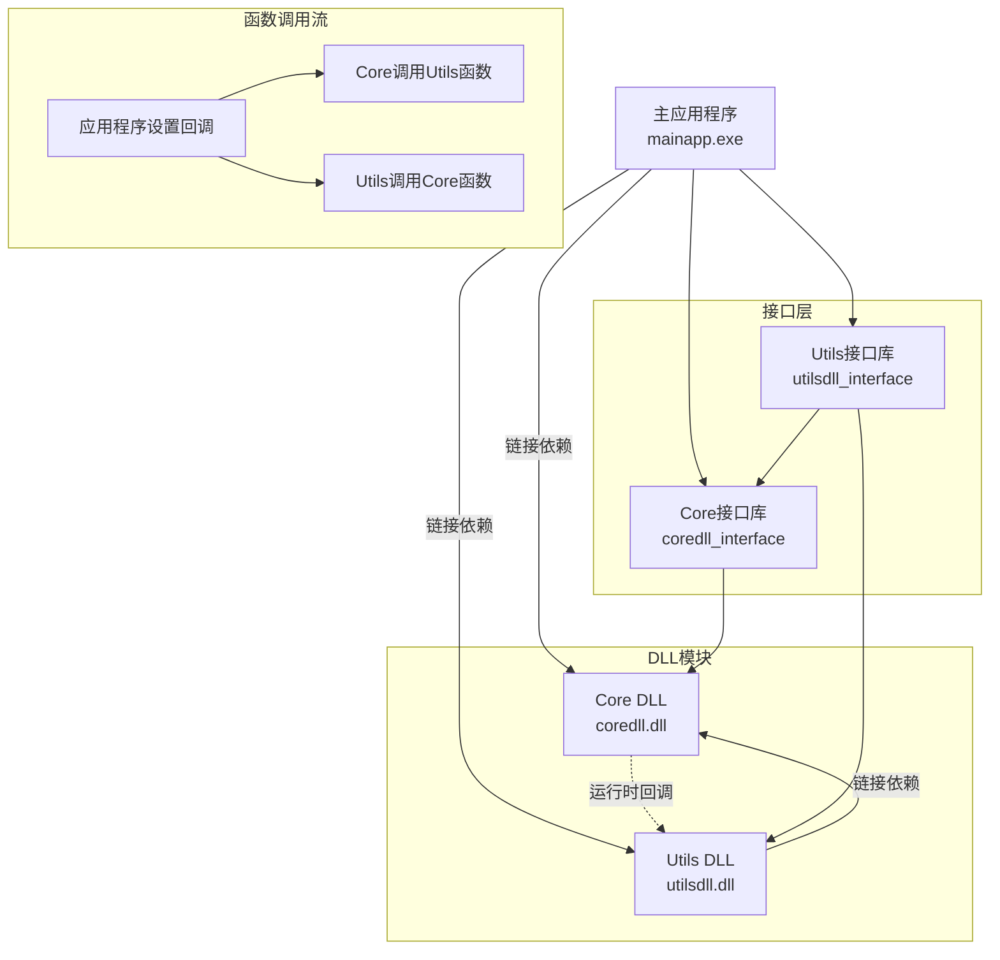

# Build
```
mkdir build  
cd build
cmake -G "MinGW Makefiles" ..
cmake -E time make -j
```

# Single DLL
```
DllDependencyTest/
├── CMakeLists.txt
├── mydll/
│   ├── CMakeLists.txt
│   ├── include/
│   │   └── mydll.h
│   └── src/
│       └── mydll.cpp
├── myapp/
│   ├── CMakeLists.txt
│   └── src/
│       └── main.cpp
└── build/
```

## Result
```
DLL Dependency Test Application
===============================
=== Testing Calculator Class ===
Calculator constructed!
Precision: 3
5.1234 + 3.4567 = 8.58
2.5 * 4.2 = 10.5
Calculator destroyed!

=== Testing C Interface ===
Calculator initialized via C interface!
Calculator constructed!
Calculator destroyed!
C interface sum: 30.8

Application finished successfully!
```

# Two DLLs
```
CircularDllDemo/
├── CMakeLists.txt
├── core/
│   ├── CMakeLists.txt
│   ├── include/
│   │   └── core.h
│   └── src/
│       └── core.cpp
├── utils/
│   ├── CMakeLists.txt
│   ├── include/
│   │   └── utils.h
│   └── src/
│       └── utils.cpp
├── app/
│   ├── CMakeLists.txt
│   └── src/
│       └── main.cpp
└── build/
```



## Result
```
=== Circular DLL Dependency Demo ===
Starting application...
[Core] Initialized via C interface
[Utils] Utilities initialized via C interface

1. Creating CoreSystem...
CoreSystem constructed
[App] [Core] Log callback set
[App] [Core] CoreSystem initialized

2. Creating UtilityManager...
[Utils] UtilityManager constructed
[Utils] UtilityManager initialized

3. Establishing circular dependencies...
[App] [Core] Utility functions set
[Utils] Core system set in UtilityManager

4. Testing functionality...
[App] [Core] Calculation processed: 3.000000, 4.000000 -> 81.000000
Core calculation result: 81
[App] [Core] String processed: 'hello world' -> 'dlrow olleh'
Core string result: dlrow olleh
[Utils] Advanced calculation: 2.000000, 3.000000 -> 10.449490
[App] [Core] Calculation processed: 2.000000, 3.000000 -> 8.000000
[Utils] Core system result: 8.000000
Utils advanced calculation: 10.4495
[Utils] String formatted: 'test message' -> '[TEST MESSAGE] FORMATTED BY UTILS'
[App] [Core] String processed: 'test message' -> 'egassem tset'
[Utils] Core system result: 'egassem tset'
Utils formatted string: [TEST MESSAGE] FORMATTED BY UTILS

5. Performing complex operations...
[Utils] Performing complex operation...
[App] [Core] Calculation processed: 10.500000, 2.000000 -> 110.250000
[App] [Core] String processed: 'complex op' -> 'po xelpmoc'
[Utils] Complex operation completed: 110.250000, po xelpmoc

6. Shutting down...
[App] [Core] CoreSystem shutdown

=== Application finished successfully ===
[Utils] UtilityManager destroyed
[App] CoreSystem destroyed
```